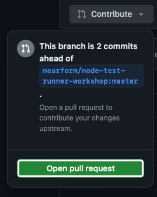

+++
title = 'My first contribution to Open Source Software'
date = 2024-04-26T15:46:19-06:00
draft = false
author = "Jose Ortiz"
tags = [
    "Node.js",
    "Open Source",
    "JavaScript",
    "Beginner"
]
categories = [
    "Open Source",
]
series = [
    "Open Source",
]
weight = 10
description = 'My experience working on my first contribution to Open Source Software, including cloning an existing repository, fixing a bug, making a Pull Request, and merging the changes'
+++

On April 16th, 2024 I did my first contribution to Open Source Software 🎉🙌

## Introduction

It all started when I was participating in a workshop from [Node Congress](https://www.nodecongress.com) 2024: *Mastering Node.JS Test Runner* by [Marco Ippolito](https://www.marcoippolito.dev) (Which was great BTW. I learned a lot about writing tests in Node.JS with the native test runner, introduced in Node.JS 20). You can find the test runner workshop [here](https://github.com/nearform/node-test-runner-workshop).

<!--more-->

## The problem

When we entered *Section A09: Dates*, we learned about how we can use the [**mock timers API**](https://nodejs.org/api/test.html#timers) to mock and control the `Date` object, quite useful when testing behaviour of methods that are dependent on a certain time of the day/week/month/year.

The task at hand was to enable `Date` mocking, set the `now()` time to a specific date, and use it to test the correct functionality of the `getCurrentFormattedDate()` method. Should be easy, right?

I configured the test file as needed to run and pass the tests, but when I tried to run the verification to pass the test, the following error occurred:


```bash
✖ getCurrentFormattedDate returns the correct format (1.953833ms)
  AssertionError [ERR_ASSERTION]: Expected values to be strictly equal:
  + actual - expected
  
  + '2024-02-18'
  - '2024-02-19'
```

As you can read, the expected date was a day later than the returned date from the method, thus the test failing. Here's the full test file:

```javascript {linenos = true}
/* eslint-disable no-unused-vars */
import assert from 'node:assert'
import { getCurrentFormattedDate } from '../src/index.js'
import { test, mock } from 'node:test'

test('getCurrentFormattedDate returns the correct format', () => {
  // Mock Date to this timestamp: 2024-02-19T00:00:00Z
  mock.timers.enable({
    apis: ['Date'],
    now: new Date('2024-02-19T00:00:00Z').getTime()
  })
  // Test the function with the mocked date
  assert.strictEqual(getCurrentFormattedDate(), '2024-02-19')
  // Advance time to this specific date: 2025-12-25T00:00:00Z
  mock.timers.setTime(new Date('2025-12-25T00:00:00Z').getTime())
  // Test the function again with the new mocked date
  assert.strictEqual(getCurrentFormattedDate(), '2025-12-25')
})
```

We use the [mock.timers.enable()](https://nodejs.org/api/test.html#timersenableenableoptions) method, and pass some configuration to control what time is used when invoking the `now()` method on Date instances while running the test suite. In this case, we configured the date to be *2024-02-19*.

I noted the error to Marco, who asked me at which timezone I was located, as he was instructing from Italy. I told him I'm located in the Americas, central time, and he promised he would debug the code later with peers from my Time Zone to see what the problem could be, as it was probably related, and we went onward with the rest of the workshop, my head still thinking about the probable cause of the error.

## Doubt is what I do[^1]

[^1]: [IYKYK](https://www.youtube.com/watch?v=_c4fY552hrc).

As soon as we finished, I decided I wanted to give a detailed look to the codebase, and try to identify where the problem may be. I started by inspecting the tested function, `getCurrentFormattedDate()`:

```javascript {linenos = true hl_lines=5}
export function getCurrentFormattedDate() {
  const now = new Date()
  return `${now.getFullYear()}-${(now.getMonth() + 1)
    .toString()
    .padStart(2, '0')}-${now.getDate().toString().padStart(2, '0')}`
}
```

The purpose of this function is to take the current `Date` and format it in a YYYY-MM-DD way, using the [getFullYear()](https://developer.mozilla.org/en-US/docs/Web/JavaScript/Reference/Global_Objects/Date/getFullYear), [getMonth()](https://developer.mozilla.org/en-US/docs/Web/JavaScript/Reference/Global_Objects/Date/getMonth), and [getDate()](https://developer.mozilla.org/en-US/docs/Web/JavaScript/Reference/Global_Objects/Date/getDate) methods of the `Date` object.

Noticing the problem was on the day of the month, I looked up how the [`getDate()`](https://developer.mozilla.org/en-US/docs/Web/JavaScript/Reference/Global_Objects/Date/getDate) method on line 5 (highlighted) worked.

> The `getDate()` method of `Date` instances return the day of the month for this date according to local time.<br>
> — <cite>MDN web docs[^2]</cite>

[^2]: [Date.prototype.getDate()](https://developer.mozilla.org/en-US/docs/Web/JavaScript/Reference/Global_Objects/Date/getDate) on MDN web docs, retrieved 25/04/2024.

**... according to local time**. Notice that last bit? the `getDate()` method uses the local time of the computer the code is running (In my case, with the UTC-6 timezone), **ignoring the mocking done on the test runner to control the date**. I was onto something here!

## The Solution

I read the MDN web docs further, looking through the methods available in the `Date` class, and soon I discovered another method that may be useful: [getUTCDate()](https://developer.mozilla.org/en-US/docs/Web/JavaScript/Reference/Global_Objects/Date/getUTCDate).

> The `getUTCDate()` method of `Date` instances return the day of the month for this date according to universal time.<br>
> — <cite>MDN web docs[^3]</cite>

[^3]: [Date.prototype.getUTCDate()](https://developer.mozilla.org/en-US/docs/Web/JavaScript/Reference/Global_Objects/Date/getUTCDate) on MDN web docs, retrieved 25/04/2024.

**... according to universal time**. Now, this makes more sense! This is the method the creators of the workshop probably intented to use in the first place. By obtaining the date based on [Universal Time](https://en.wikipedia.org/wiki/Coordinated_Universal_Time), the mocking done on the test suite should now be respected during test runs.

We modify the `getCurrentFormattedDate()` a little bit to introduce this fix:

```javascript {linenos = true hl_lines=5}
export function getCurrentFormattedDate() {
  const now = new Date()
  return `${now.getFullYear()}-${(now.getMonth() + 1)
    .toString()
    .padStart(2, '0')}-${now.getUTCDate().toString().padStart(2, '0')}`
}
```

Running the test suite after the change now grants us **success** 🍾!

```bash
✔ getCurrentFormattedDate returns the correct format (1.850041ms)
✔ getCurrentFormattedDate returns the correct format (1.882667ms)
ℹ tests 2
ℹ suites 0
ℹ pass 2
ℹ fail 0
ℹ cancelled 0
ℹ skipped 0
ℹ todo 0
ℹ duration_ms 64.685417
```

## The Contribution

Having found a solution, I wanted to create a Pull Request to the workshop's repository to fix the bug on the codebase and save a headache to future students of Marco or anyone else on the team from this side of the world (or a different Time Zone other than Europe for that matter 🌏 🌎 🌍, shoutout to Node.JS devs from Africa, Asia, Oceania, and the Americas 🙌). To achieve this, I began by doing a fork to my personal account of the workshop's code and then cloning it locally to do the modification. I applied the changes to the file I fixed on my local code to the forked repository, and pushed them online.

Next, I opened a pull request using the *Contribute* option on my forked version of the repo.


{style="display:block; margin-left:auto; margin-right:auto;"}

In the body of the [Pull Request](https://github.com/nearform/node-test-runner-workshop/pull/42), I explained the bug I recently found during the workshop, how I reached the solution and asking for feedback on style or a contributing standard before the PR was approved and merged (If possible, always look for a CONTRIBUTING.MD file, where open source project maintainers explain the way you can contribute to the project, steps to follow, templates to use, etc.).

After some time, [Simone Busoli](https://github.com/simoneb), one of the project's maintainers, approved and merged my changes, thus making my first contribution to Open Source Software official 😎!

## Lessons Learned

This experience taught me a lot about the benefits of having Open Source codebases. The fact that I was able to inspect the code and look how it worked internally in order to find the bug (instead of depending on a stack trace, and in some cases not even that 🧐) was a huge help in finding the problem, with the help of up-to-date open source documentation from MDN web docs too. Being able to not only correct the bug on my personal codebase, but contribute a patch to the original workshop so that other users in the future don't meet the same problem, and not needing to wait for the original maintainers to apply changes to the code is also a huge plus (it's a win-win situation: they save time they would have otherwise invested making the change, we benefit with code that's constantly improving with the help of many volunteer contributors). I hope I can continue to contribute to Open Source Software in the future. Meanwhile, I'll keep learning how software around me works 🤔.

## Acknowledgments

I want to thank [Node Congress](https://www.nodecongress.com) for the opportunity to attend the workshop on the first place, [Marco Ippolito](https://www.marcoippolito.dev) for delivering a great workshop experience on learning about the Node.JS Test Runner, with the openess to answer all ouf our questions and taking time to note bugs and side effects (Go check out the projects he is currently working on in the Open Source Community, specially on Node.JS), [Simone Busoli](https://github.com/simoneb) for their kind comments after merging my PR and taking the time to review it, [Nearform](https://www.nearform.com) for providing the opportunity to their employees to work on Open Source Software and making this workshop, and lastly the whole Open Source community for embracing openess and collaboration ✨.

-- Jose

## Further Reading

- [The Node.js Test Runner Workshop, by Nearform](https://github.com/nearform/node-test-runner-workshop)
- [The Date object reference, on MDN web docs](https://developer.mozilla.org/en-US/docs/Web/JavaScript/Reference/Global_Objects/Date)
- [The Node.js Test Runner reference](https://nodejs.org/api/test.html)
